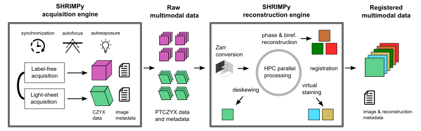

# shrimPy: Smart High-throughput Robust Imaging & Measurement in Python


shrimPy (pronounced: ʃrɪm-pai) is a pythonic framework for high-throughput smart microscopy and high-performance analysis. The current alpha version of the framework is specific to the mantis microscope, described in our [manuscript](https://doi.org/10.1093/pnasnexus/pgae323), but extensible to a high throughput microscope that is controlled with [Micro-Manager](https://micro-manager.org/).

The acquisition engine synchronizes data collection using hardware triggering and carries out smart microscopy tasks such as autofocus and autoexposure.

The acquired multidimensional raw datasets are processed with the [biahub](https://github.com/czbiohub-sf/biahub) library to generate registered multimodal data that can be used for analysis. Raw data are first converted to the [OME-Zarr](https://ngff.openmicroscopy.org/) format using [iohub](https://github.com/czbiohub-sf/iohub) to facilitate parallel processing and metadata management. Discrete data volumes then undergo deskewing of fluorescence channels, reconstruction of phase and orientation (using [recOrder](https://github.com/mehta-lab/recOrder)), registration and virtual staining (using [VisCy](https://github.com/mehta-lab/viscy)).

This version of the code contains an acquisition engine for the `mantis` microscope, including several archived versions. We intend to develop additional acquisition engines for the `iSIM` and `Dragonfly` microscopes within this framework. These acquisition engines are expected to have shared features but also to accommodate differences between the microscope hardware and the acquisition needs on each microscope.

## Installation

We recommend using a virtual conda environment with Python 3.11:

```sh
conda create -y --name shrimpy python=3.11
conda activate shrimpy

git clone https://github.com/czbiohub-sf/shrimPy.git
pip install ./shrimpy
```

Optionally, you can also install the [biahub](https://github.com/czbiohub-sf/biahub) image analysis library in the same environment. `biahub` is currently used when characterizing the microscope point spread function, and will be used for real-time image processing in the future. You can install both libraries in a single step with:

```sh
conda create -y --name shrimpy python=3.11
conda activate shrimpy

git clone https://github.com/czbiohub-sf/shrimPy.git
git clone https://github.com/czbiohub-sf/biahub.git
pip install ./shrimpy ./biahub
```

## Setting up the mantis microscope
The mantis microscope implements simultaneous label-free and light-sheet imaging as described in [Ivanov et al.](https://doi.org/10.1093/pnasnexus/pgae323) The two imaging modalities are acquired on two independent arms of the microscope running separate instances of [Micro-Manager](https://micro-manager.org/) and [pycromanager](https://pycro-manager.readthedocs.io/). shrimPy and [biahub](https://github.com/czbiohub-sf/biahub) were developed to enable robust long-term imaging with mantis and efficient analysis of the resulting TB-scale datasets on a high-performance compute cluster.

The [Setup Guide](docs/setup_guide.md) outlines how the mantis microscope is configured.


## Data acquisition with mantis

Mantis acquisitions and analyses use a command-line interface.

A list of `mantis` commands can be displayed with:
```sh
shrimpy --help
```

Data are acquired using `shrimpy acquire <microscope_name>`, and a list of arguments can be displayed with:

```sh
shrimpy acquire mantis --help
```

The shrimPy acquisitions is configured using a YAML file. An example of a configuration file can be found [here](examples/acquisition_settings/example_acquisition_settings.yaml).

This is an example of a command which will start an acquisition using the mantis acquisition engine:

```pwsh
shrimpy acquire mantis \
    --config-filepath path/to/config.yaml \
    --output-dirpath ./YYYY_MM_DD_experiment_name/acquisition_name
```

The acquisition may also be run in "demo" mode with the Micro-manager `MMConfig_Demo.cfg` config. This does not require any microscope hardware. A demo run can be started with:

```pwsh
shrimpy acquire mantis \
    --config-filepath path/to/config.yaml \
    --output-dirpath ./YYYY_MM_DD_experiment_name/acquisition_name \
    --mm-config-filepath path/to/MMConfig_Demo.cfg
```

## Data reconstruction

Data reconstruction is accomplished with the [biahub](https://github.com/czbiohub-sf/biahub) library. Visit the link for the latest information on our reconstruction workflows.

## Data and metadata format

The format of the raw and reconstructed data and associated metadata is documented [here](/docs/data_structure.md).

## Contributing
We are updating the code to enable smart high throughput microscopy on any Micro-Manager controlled microscope. The code will have rough edges for the next several months. We appreciate the bug reports and code contributions if you use this package. If you would like to contribute to this package, please read the [contributing guide](CONTRIBUTING.md).
