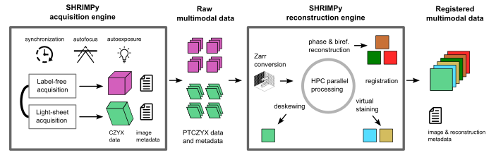

# shrimPy: Smart High-throughput Robust Imaging & Measurement in Python


shrimPy (pronounced: ʃrɪm-pai) is a pythonic framework for high-throughput smart microscopy and high-performance analysis. The current alpha version of the framework is specific to the mantis microscope, described in our [manuscript](https://doi.org/10.1093/pnasnexus/pgae323), but extensible to a high throughput microscope that is controlled with [Micro-Manager](https://micro-manager.org/).

The acquisition engine synchronizes data collection using hardware triggering and carries out smart microscopy tasks such as autofocus and autoexposure.

The acquired multidimensional raw datasets are processed with the [biahub](https://github.com/czbiohub-sf/biahub) library to generate registered multimodal data that can be used for analysis. Raw data are first converted to the [OME-Zarr](https://ngff.openmicroscopy.org/) format using [iohub](https://github.com/czbiohub-sf/iohub) to facilitate parallel processing and metadata management. Discrete data volumes then undergo deskewing of fluorescence channels, reconstruction of phase and orientation (using [recOrder](https://github.com/mehta-lab/recOrder)), registration and virtual staining (using [VisCy](https://github.com/mehta-lab/viscy)).

This version of the code contains an acquisition engine for the `mantis` microscope, including several archived versions. We intend to develop additional acquisition engines for the `iSIM` and `Dragonfly` microscopes within this framework. These acquisition engines are expected to have shared features but also to accommodate differences between the microscope hardware and the acquisition needs on each microscope.

## Installation

This project uses [uv](https://docs.astral.sh/uv/) for package management. uv handles Python installation, virtual environments, and dependency locking automatically.

### Prerequisites

Install uv (if not already installed):

```sh
curl -LsSf https://astral.sh/uv/install.sh | sh
```

### Install

```sh
git clone https://github.com/czbiohub-sf/shrimPy.git
cd shrimPy
uv sync
```

This will automatically:
- Download and install Python 3.12 (if not already available)
- Create a `.venv` virtual environment
- Install shrimPy, its dependencies, and the development tooling

`pymmcore-plus`, `ome-writers`, and `useq-schema` track git branches pinned in `pyproject.toml` and are fetched for you. They do not need to be cloned separately.

### Optional features

The core install is headless and pulls no Qt bindings, so `shrimpy acquire` works on a bare server. Opt into the features you need:

```sh
uv sync --extra gui        # `shrimpy gui` (pymmcore-gui)
uv sync --extra viewer     # live napari viewer during acquisition
uv sync --extra dynatrack  # DynaTrack position tracking (biahub, torch)
uv sync --all-extras       # all of the above
```

On Windows the `dynatrack` extra pulls the CUDA build of PyTorch, which requires the CUDA Toolkit to be installed. The `viewer` extra needs access to the `napari-deskew-preview` repository.

### Verify the installation

```sh
uv run python -c "import shrimpy; print('shrimPy installed successfully')"
```

## Usage

### Running the GUI

```sh
uv run shrimpy gui
```

The older Mantis-specific acquisition widget is deprecated and kept for
reference in `archive/`.

### CLI

A list of available commands can be displayed with:

```sh
uv run shrimpy --help
```

Data are acquired using `shrimpy acquire <microscope_name>`:

```sh
uv run shrimpy acquire mantis \
    --mm-config path/to/mantis.cfg \
    --mda-config path/to/sequence.yaml \
    --output-dir ./YYYY_MM_DD_experiment_name \
    --name acquisition_name
```

The acquisition may also be run in "demo" mode with the Micro-Manager `MMConfig_Demo.cfg` config. This does not require any microscope hardware:

```sh
uv run shrimpy acquire mantis \
    --mm-config path/to/MMConfig_Demo.cfg \
    --mda-config config/mda/mantis/demo.yaml \
    --output-dir ./YYYY_MM_DD_experiment_name \
    --name acquisition_name
```

The output directory must already exist.

Acquisitions are configured using YAML files, each an `MDASequence` with the microscope settings under `metadata`. See [config/mda/](config/mda/) for example configurations.

## Setting up the mantis microscope

The mantis microscope implements simultaneous label-free and light-sheet imaging as described in [Ivanov et al.](https://doi.org/10.1093/pnasnexus/pgae323) The two imaging modalities are acquired on two independent arms of the microscope running separate instances of [Micro-Manager](https://micro-manager.org/) and [pycromanager](https://pycro-manager.readthedocs.io/). shrimPy and [biahub](https://github.com/czbiohub-sf/biahub) were developed to enable robust long-term imaging with mantis and efficient analysis of the resulting TB-scale datasets on a high-performance compute cluster.

The [Setup Guide](docs/setup_guide.md) outlines how the mantis microscope is configured.

## Data reconstruction

Data reconstruction is accomplished with the [biahub](https://github.com/czbiohub-sf/biahub) library. Visit the link for the latest information on our reconstruction workflows.

## Data and metadata format

The format of the raw and reconstructed data and associated metadata is documented [here](docs/data_structure.md).

## Development

### Code quality

```sh
# Format code
make format

# Check formatting and linting without modifying files
make check

# Run tests
make test
```

### Pre-commit hooks

Install pre-commit hooks (required for contributors):

```sh
uv run pre-commit install
```

## Contributing

We are updating the code to enable smart high throughput microscopy on any Micro-Manager controlled microscope. The code will have rough edges for the next several months. We appreciate the bug reports and code contributions if you use this package. If you would like to contribute to this package, please read the [contributing guide](CONTRIBUTING.md).
